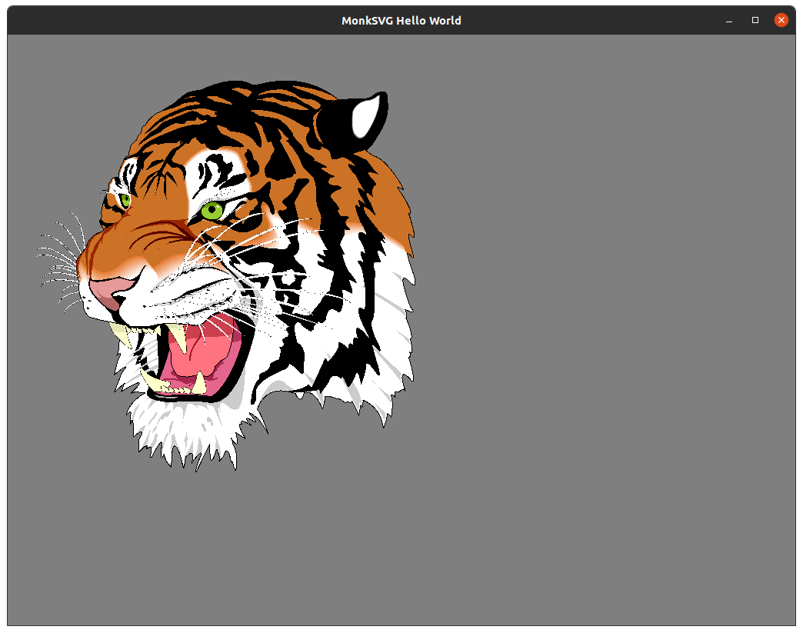

MonkVG: An OpenVG implementation
==================================


## Overview

MonkVG is an OpenVG 1.1 *like* vector graphics API implementation currently using an Vulkan 1.1 or OpenGL 3.3 backend that should be compatible with any HW that supports Vulkan or OpenGL.

This is an open source BSD licensed project that is in active development. Contributors and sponsors welcome.

It can be found at GitHub http://github.com/micahpearlman/MonkVG

Projects using MonkVG include:

- MonkSVG: A SVG parser and renderer.  https://github.com/micahpearlman/MonkSVG
- CCSVG: A SVG renderer for Cocos2D. https://github.com/lukelutman/CCSVG

## Whats New

- (11/11/2024) Added Python Bindings.  See `examples/python_opengl.py` for an example.
- (10/22/2024) Added Vulkan 1.1 backend.  
- (9/6/2024) Complete refactor of the code base.  Currently only OpenGL 3.3 backend is supported.
- (2/17/2022) CMake build support and GLFW example.
- (1/22/2012) Now supports OpenGL ES 1.1 *AND* 2.0 (NOTE: as of 9/6/2024 only OpenGL 3.3 is supported)


## Installation

Use git to clone:  

```
git clone --recursive https://github.com/micahpearlman/MonkVG.git
```

Examples requires the GLFW library to be installed.  On MacOS:

```
brew install glfw
```

Debian/Ubuntu:

```
sudo apt-get install libglfw3-dev
```

For MacOS Vulkan support install MoltenVK:

```
brew install molten-vk
```

### CMake Build

```
mkdir ./build
cd ./build

cmake ..
cmake --build .

# run the GLFW example
./glfw_hello_world 
```


### Python Build

```
pip install git+https://github.com/micahpearlman/MonkVG.git
```


#### MacOS Arm Notes

The standard brew glfw library won't work on M1 Mac.  To install the correct version:

```
# Remove GLFW
brew uninstall glfw

# Build GLFW from source
git clone https://github.com/glfw/glfw.git && \
cd glfw && \
cmake -DCMAKE_OSX_ARCHITECTURES=arm64 . && \
make && \
sudo make install
```
## What is implemented

- Most all path segment commands including: moves, lines, bezier curves, elliptical arcs.
- Robust contour tesselation supporting both fill rules.
- Very basic stroking.
- Most paints including: Solid color fill, linear and radial gradients.  
- Bitmap font rendering.
- Bitmap image rendering.
- OpenVG utility library (see vgu.h)
	
## TODO
- Pattern fills and strokes.
- Gradient fills on strokes (works for fills).
- Stroke font rendering (may work just untested).
- Various blending modes (somewhat working already).
- Scissoring and masking.
- Improve stroking geometry generation.

## Probably never support
- Image filters.
- Anti-aliasing. (Though this can be supported outside OpenVG.  For example iOS fullscreen AA glRenderbufferStorageMultisampleAPPLE method)

## Extensions

MonkVG was originally created for games, so speed has usually been prefered over quality or full OpenVG compliance.  To improve speed there have been MonkVG specific extensions. See "vgext.h" for some of the details.

## Contributors

Paul Holden (Initial Android Port)  
Vincent Richomme (Windows Port)  
Gav Wood (Android and Linux Port) 

Also Luke contributed a great article on how to integrate MonkVG + MonkSWF with Cocos2D: http://blog.zincroe.com/2011/11/displaying-a-swf-on-the-iphone-with-cocos2d-and-monkswf/

## Simple Example

See `./examples` directory.

NOTE:  MonkVG will not create a OpenGL context, it is the applications responsibility to create there own OpenGL context.
Also, if your application does any other OpenGL rendering it should save off the GL state and then restore before calling any MonkVG methods.

```
	
VGPaint _paint;
VGPath _path;
void init() {
	... setup platform specific opengl ...
	// setup the OpenVG context
	vgCreateContextMNK( 320, 480, VG_RENDERING_BACKEND_TYPE_OPENGLES20 );

	...OR... for OpenGL ES 1.1

	vgCreateContextMNK( 320, 480, VG_RENDERING_BACKEND_TYPE_OPENGLES11 );

	// create a paint
	_paint = vgCreatePaint();
	vgSetPaint(_paint, VG_FILL_PATH );
	VGfloat color[4] = { 1.0f, 0.0f, 0.0f, 1.0f };
	vgSetParameterfv(_paint, VG_PAINT_COLOR, 4, &color[0]);

	// create a box path
	_path = vgCreatePath(VG_PATH_FORMAT_STANDARD, VG_PATH_DATATYPE_F,1,0,0,0, VG_PATH_CAPABILITY_ALL);
	vguRect( _path, 50.0f, 50.0f, 90.0f, 50.0f );
}
	
void draw() {
	... save any GL state here ...
	... start opengl context ...

	/// draw the basic path
	vgSeti(VG_MATRIX_MODE, VG_MATRIX_PATH_USER_TO_SURFACE);
	vgLoadIdentity();
	vgTranslate( screenWidth/2, screenHeight/2 );
	vgSetPaint( _paint, VG_FILL_PATH );
	vgDrawPath( _path, VG_FILL_PATH );

	... end opengl context ...
	... restore and GL state here ...
}
```

